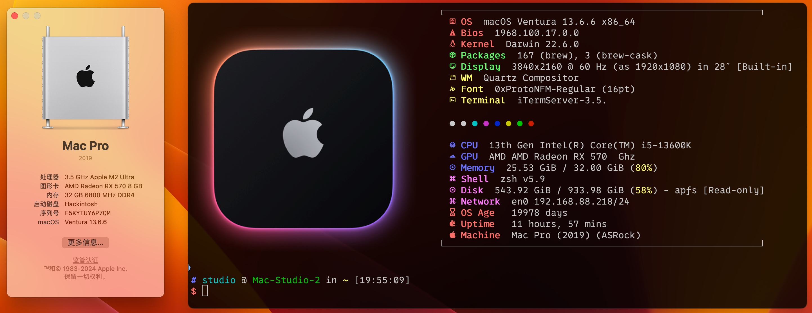
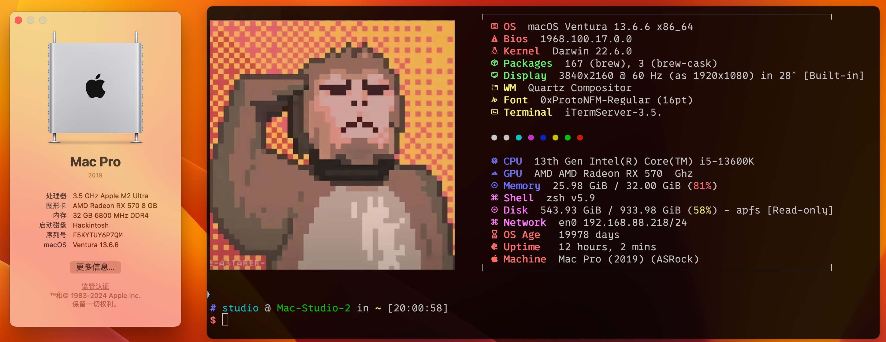
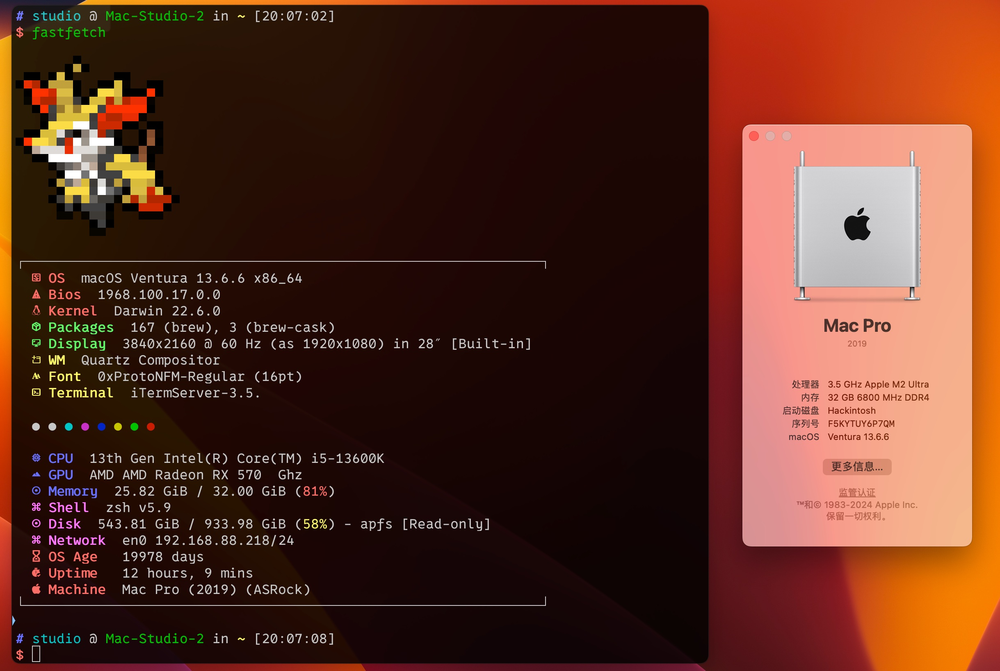

# Fastfetch with Pokemon

[](https://github.com/sqlsec/fastfetch/releases) [](https://github.com/sqlsec/fastfetch/blob/dev/LICENSE)  [](https://github.com/sqlsec/fastfetch/releases)

Fastfetch 是一个类似 [neofetch](https://github.com/dylanaraps/neofetch) 的工具，用于获取系统信息并漂亮地显示它。它主要用 C 语言编写，并考虑了性能和可定制性。本项目是一个 Fastfetch 轮子，主要是集成了宝可梦显示和其他系列的恶搞图片，目前只在 Linux 和 macOS 平台下测试过。

## Installation

### Linux

### macOS

#### 安装 Fastfetch

- [HomeBrew](https://formulae.brew.sh/formula/fastfetch#default)

  ````bash
  brew install fastfetch
  ````

- [MacPorts](https://ports.macports.org/port/fastfetch/)

  ````bash
  sudo port install fastfetch
  ````

#### 安装 [pokemon-colorscripts](https://gitlab.com/phoneybadger/pokemon-colorscripts)

克隆或下载存储库：

```bash
git clone https://gitlab.com/phoneybadger/pokemon-colorscripts.git
```

`cd`进入目录并运行安装脚本：

```bash
cd pokemon-colorscripts
sudo ./install.sh
```

测试是否正常工作：

```bash
pokemon-colorscripts -r --no-title
```

#### 字体安装

为了终端下的字体图标正常显示，建议大家下载一些自带字体图标的字体，可以去 [Nerd Fonts - Iconic font aggregator, glyphs/icons collection, & fonts patcher](https://www.nerdfonts.com/font-downloads) 下载自己喜欢的字体。

国光我在 macOS 下测试 [0xProtoNerdFont](https://github.com/ryanoasis/nerd-fonts/releases/download/v3.2.1/0xProto.zip) 字体是可以正常显示图标的。

#### 导入预设

接着了手动去  [](https://github.com/sqlsec/fastfetch/releases) 下载对应的系统的预设方案，解压将其放到用户 home 下的 `.config` 目录下即可：

```bash
# 进入 .config 目录
cd $HOME/.config

# 下载并解压然后删除
wget https://github.com/sqlsec/fastfetch/releases/download/v0.1/fastfetch-for-macOS.zip
unzip fastfetch-for-macOS.zip && rm fastfetch-for-macOS.zip 
```

 #### 更换预设

不同的 `.jsonc` 就是不同的预设方案，如果启用的话，将其重命名为 `config.jsonc` 即可切换为默认的预设方案：

- **config-macos-logo.jsonc**

 

- **config-macos-animal.jsonc**



- **config-macos-pokemon.jsonc**



## Trouble

**Q：** 为什么我的终端字体图标不能正常显示？

**A：** 建议大家下载一些自带字体图标的字体，可以去 [Nerd Fonts](https://www.nerdfonts.com/font-downloads) 下载自己喜欢的字体。


**Q：** 为什么我的终端左侧的 logo 图像不能正常显示？

**A：** 这是因为你的终端不支持图像协议的原因，如果是 macOS 用户建议使用 [iTerm2](https://iterm2.com/) 终端，Linux 用户建议使用 [Kitty](https://sw.kovidgoyal.net/kitty/) 终端。


## Star History

欢迎点个小小的 Star 支持一下！

<a href="https://star-history.com/#sqlsec/fastfetch&Date">
  <picture>
    <source media="(prefers-color-scheme: dark)" srcset="https://api.star-history.com/svg?repos=sqlsec/fastfetch&type=Date&theme=dark" />
    <source media="(prefers-color-scheme: light)" srcset="https://api.star-history.com/svg?repos=sqlsec/fastfetch&type=Date" />
    
  </picture>
</a>